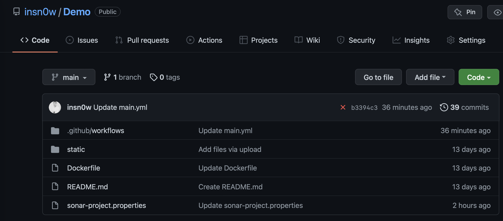
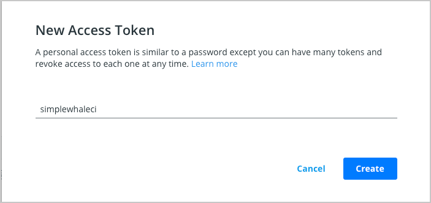
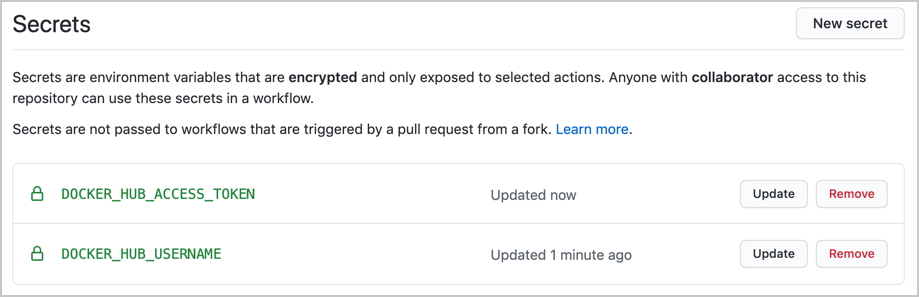
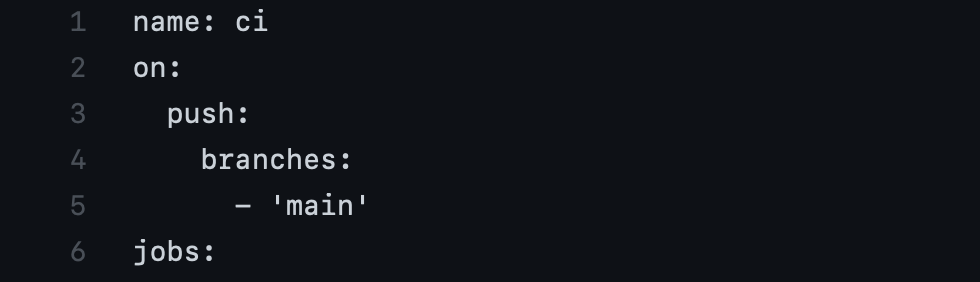
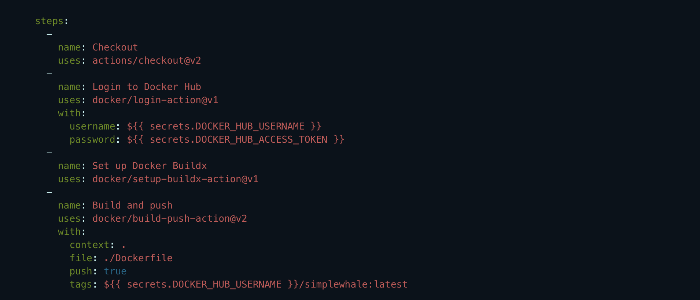
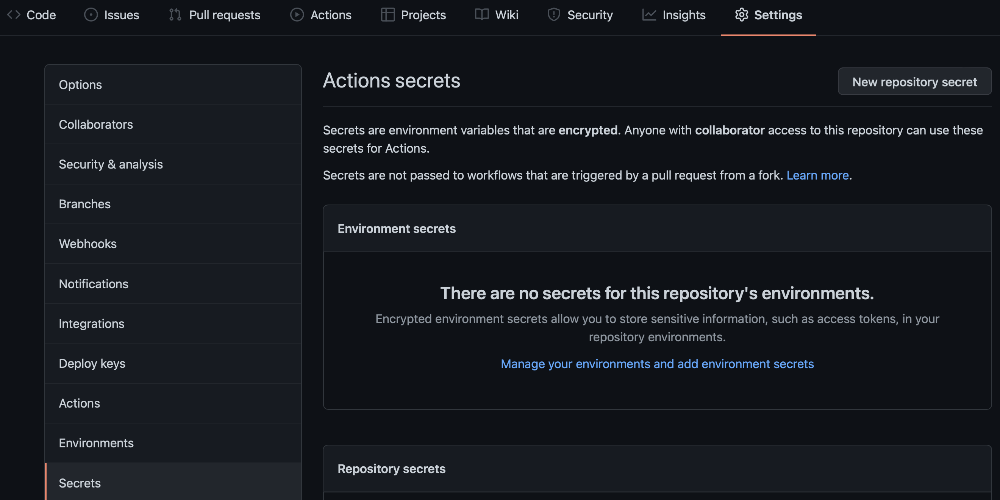

This guide contains instructions on how to:

Use a sample Docker project as an example to configure GitHub Actions.

 1. Set up the GitHub Actions workflow.
 2. Optimize your workflow to reduce build time.
 3. Push only specific versions to Docker Hub.
 4. Set up a Docker project

This guide uses a simple Docker project as an example. The Demo repository contains a Nginx alpine image. You can either clone this repository, or use your own Docker project.

Before we start, ensure you can access Docker Hub from any workflows you create. 
To do this:

   1. Add your Docker ID as a secret to GitHub. Navigate to your GitHub repository and click Settings > Secrets > New secret.

   2. Create a new secret with the name **DOCKER_HUB_USERNAME** and your Docker ID as value.

   3. Create a new Personal Access Token (PAT). To create a new token, go to Docker Hub Settings and then click New Access Token.

   4. Let’s call this token simplewhaleci or use want you want!!!

         

   5. Now, add this Personal Access Token (PAT) as a second secret into the GitHub secrets UI with the name **DOCKER_HUB_ACCESS_TOKEN**.

         
         
         
   **Set up the GitHub Actions workflow**
   
In the previous section, we created a PAT and added it to GitHub to ensure we can access Docker Hub from any workflow. Now, let’s set up our GitHub Actions workflow to build and store our images in Hub.

In this example, let us set the push flag to true as we also want to push. We’ll then add a tag to specify to always go to the latest version. Lastly, we’ll echo the image digest to see what was pushed.

To set up the workflow:

Go to your repository in GitHub and then click Actions > New workflow.
Click set up a workflow yourself and add the following content:      

        
   
   
    
   
   
Now, add the steps required:

   - The first one checks-out our repository under $GITHUB_WORKSPACE, so our workflow can access it.
   - The second one will use our PAT and username to log into Docker Hub.
   - The third will setup Docker Buildx to create the builder instance using a BuildKit container under the hood.

        

**Create and add tests to code**

     

docker-whale

Run me : docker run -p80:80 insn0w/simplewhale:latest

Build me: docker build -t insn0w/simplewhale:latest .
