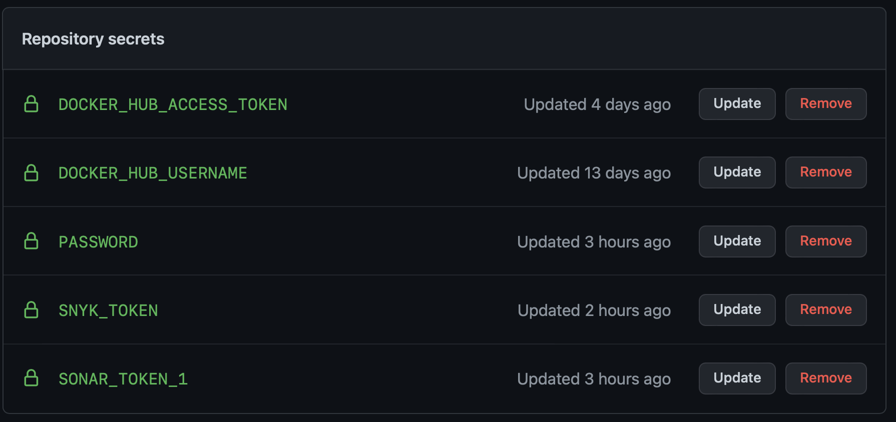
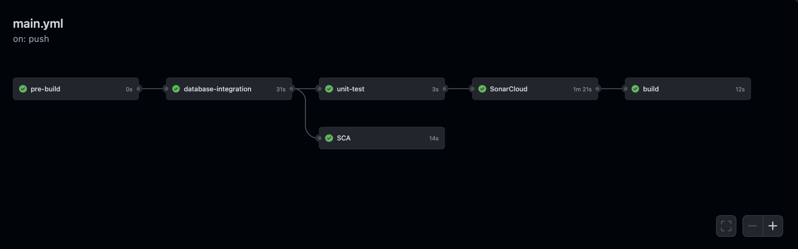

# **This a process of setting up a GitHub Action CI/CD pipeline with Docker.**

This guide contains instructions on how to use a Docker project and configure GitHub Actions.

**Steps:**
 1. Set up the GitHub Actions workflow.
 2. Optimize your workflow to reduce build time.
 4. Set up a Docker project
 
 The Demo repository contains a Nginx alpine image. You can either clone this repository, or use your own Docker project.

Before we start, ensure you can access Docker Hub from any workflows you create. 
To do this:
 1. Add your Docker ID as a secret to GitHub. Navigate to your GitHub repository and click Settings > Secrets > New secret.
 2. Create a new secret with the name **DOCKER_HUB_USERNAME** and your Docker ID as value.
 3. Create a new Personal Access Token (PAT). To create a new token, go to Docker Hub Settings and then click New Access Token.
 4. Let’s call this token simplewhaleci or use want you want!!!
       
  
  
  5. Now, add this Personal Access Token (PAT) as a second secret into the GitHub secrets UI with the name **DOCKER_HUB_ACCESS_TOKEN**.
 
     
  
   **Set up the GitHub Actions workflow**
In the previous section, we created a PAT and added it to GitHub to ensure we can access Docker Hub from any workflow. Now, let’s set up our GitHub Actions workflow to build and store our images in Hub.

In this example, let us set the push flag to true as we also want to push. We’ll then add a tag to specify to always go to the latest version. Lastly, we’ll echo the image digest to see what was pushed.

To set up the workflow:

Go to your repository in GitHub and then click Actions > New workflow.
Click set up a workflow yourself and add the following content.  In this example, push against the main branch of project:      

 
   
    on:
      push:
        branches:
          - 'main'

 Build and runs on the latest Ubuntu instances available:

 
   
     jobs:
       build:
          runs-on: ubuntu-latest
   
  
Now, add the steps required:

   - The first one checks-out our repository under $GITHUB_WORKSPACE, so our workflow can access it.
   - The second one will use our PAT and username to log into Docker Hub.
   - The third will setup Docker Buildx to create the builder instance using a BuildKit container under the hood.

  <!--- and --->
   
   
             steps:
      -
        name: Checkout 
        uses: actions/checkout@v2
      -
        name: Login to Docker Hub
        uses: docker/login-action@v1
        with:
          username: ${{ secrets.DOCKER_HUB_USERNAME }}
          password: ${{ secrets.DOCKER_HUB_ACCESS_TOKEN }}
      -
        name: Set up Docker Buildx
        uses: docker/setup-buildx-action@v1
      -
        name: Build and push
        uses: docker/build-push-action@v2
        with:
          context: .
          file: ./Dockerfile
          push: true
          tags: ${{ secrets.DOCKER_HUB_USERNAME }}/simplewhale:latest
   

Create tests and add to worflow, but first create new secrets for tests.

1. On GitHub, navigate to the main page of the repository.
2. Under your repository name, click on the "Settings" tab.
3. In the left sidebar, click Secrets.
4. On the right bar, click on "New repository secret" 

 

5. Create following secrets   

 

Optimize workflow to reduce build time is optional step. 

Can be optimized the GitHub Actions workflow through build cache using the registry. This allows to reduce the build time as it will not have to run instructions that have not been impacted by changes in Dockerfile or source code and also reduce number of pulls we complete against Docker Hub.

        name: Build and push
        uses: docker/build-push-action@v2
        with:
          context: ./
          file: ./Dockerfile
          builder: ${{ steps.buildx.outputs.name }}
          push: true
          tags: ${{ secrets.DOCKER_HUB_USERNAME }}/simplewhale:latest
          cache-from: type=registry,ref=${{ secrets.DOCKER_HUB_USERNAME }}/simplewhale:buildcache
          cache-to: type=registry,ref=${{ secrets.DOCKER_HUB_USERNAME }}/simplewhale:buildcache,mode=max

Add test to workflow: 
Snyk

      - uses: actions/checkout@master
        continue-on-error: true
      - name: Run Snyk to check for vulnerabilities
        uses: snyk/actions/docker@master
        env:
          SNYK_TOKEN: ${{ secrets.SNYK_TOKEN }}
        with:
          command: monitor
          #command: scan
          #args: --file=Demo/Dockerfile
          #args: --docker insn0w/whale-example  --file=Demo/Dockerfile --project-name=insn0w/Demo
          args: --docker insn0w/simplewhale:https://hub.docker.com/u/insn0w --file=Dockerfiledocker-whale

Sonar
    
           steps:
      - uses: actions/checkout@v2
        with:
          fetch-depth: 0  # Shallow clones should be disabled for a better relevancy of analysis
      - name: SonarCloud Scan
        uses: SonarSource/sonarcloud-github-action@master
        env:
          GITHUB_TOKEN: ${{ secrets.GITHUB_TOKEN }}  # Needed to get PR information, if any
          SONAR_TOKEN: ${{ secrets.SONAR_TOKEN_1 }}
   

Workflow diagram: 

Finally We did it: 

https://user-images.githubusercontent.com/92552519/150640977-1f58b20d-4341-453a-ba92-fd051657bdd3.mov

